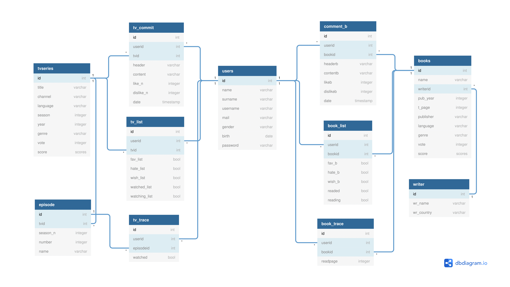

Developer Guide
===============

Database Design
---------------

We provided database management with elephansql.

We created the create queries of all tables in the dbinit.py file and ran this file before developing the program to ensure that all tables were created.

We created a domain called scores to define score. All tables are created in "INIT_STATEMENTS"

.. code-block:: sql

	 CREATE DOMAIN SCORES AS FLOAT
            DEFAULT 0.0
            CHECK((VALUE>=0.0) AND (VALUE<=10.0)); 

When starting the project, we implemented the Users table and its operations together.

.. code-block:: sql

    CREATE TABLE users(
            ID SERIAL PRIMARY KEY,
            NAME VARCHAR(20) NOT NULL,
            SURNAME VARCHAR(20) NOT NULL,
            USERNAME VARCHAR(20) UNIQUE NOT NULL,
            mail VARCHAR(80) UNIQUE NOT NULL,
            gender VARCHAR(6) NOT NULL,
            birth DATE NOT NULL,
            password VARCHAR(80) NOT NULL
            );

Requirements
--------------

We implemented the website with python_flask. And we've built our site using the following additional packages.

.. code-block:: guess

	Flask>=1.0
   psycopg2-binary>=2.7
   gunicorn>=19.9
   flask-wtf>=0.14
   flask-bcrypt>=0.7.1
   flask-login>=0.4.1

For web design, we used the bootsrap based Ui package from http://colorlib.com

Layout
------

Layout html page was created.

Navigation bar designed. The following code was used in layout.html to make it visible only when the user logged in:

  .. code-block:: HTML

      
      nav class="navbar navbar-expand-lg navbar-dark ftco_navbar bg-primary ftco-navbar-light" id="ftco-navbar">
      ..

Alerts are designed in layout.html. Thus, this design would appear in any flash message.

   .. code-block:: HTML

           
        

            

                

                    
                    

                        <i class="ion-ios-checkmark-circle "></i>
                    

                    
<b>Success Alert:</b> Yeey! {{message}}

                    

.. toctree::

   neslihan
   muruvvet
