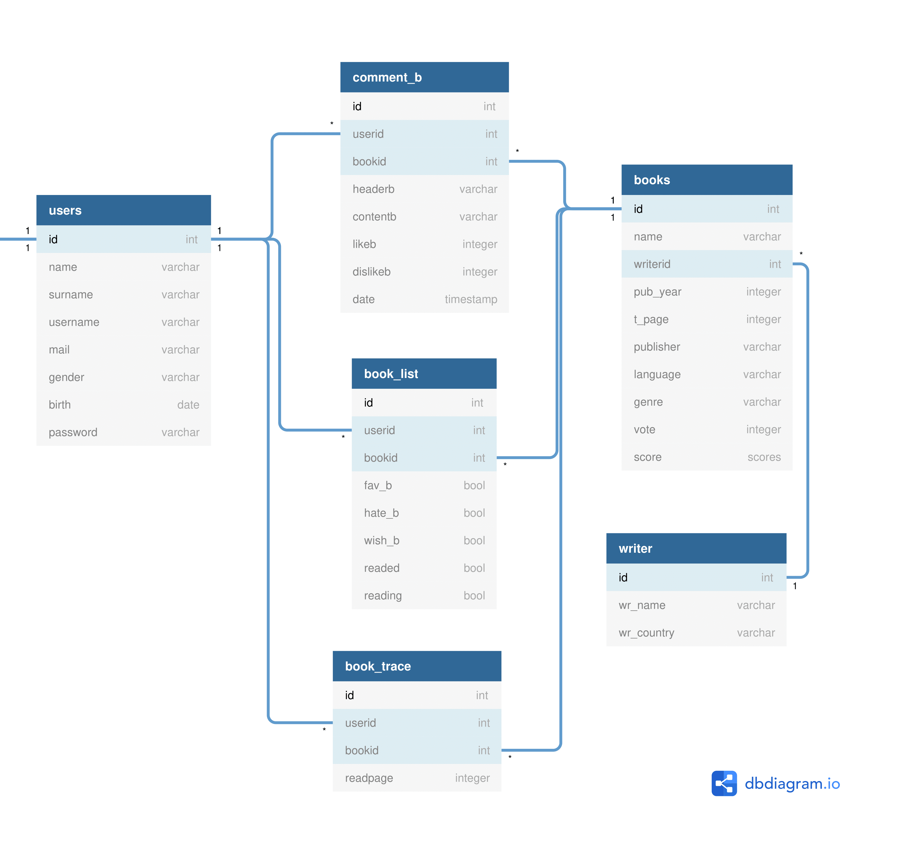

Parts Implemented by Mürüvvet BOZKURT
=====================================

Creation of Tables
=====================

.. note:: All table creations exist in dbinit.py file.

Firstly, I thought of all the tables I would use and created them. There are 3 main tables and 2 extra tables for books. My main tables are "books", "book_list", "comment_b" and my extra tables are "Writer" and "Book_trace". I do not need the "Writer" table, but I did not delete it because it would be hard to make changes because I started writing the code. The reason for "on delete cascade" addition will be explained in the account.py

.. code-block:: sql

	CREATE TABLE writer(
            ID SERIAL PRIMARY KEY,
            wr_name VARCHAR(50) NOT NULL UNIQUE,
            wr_country VARCHAR(50)
        );,

          CREATE TABLE books(
            ID SERIAL PRIMARY KEY,
            NAME VARCHAR(80) UNIQUE NOT NULL,
            WRITERID INTEGER REFERENCES writer(id),
            PUB_YEAR INTEGER,
            T_PAGE INTEGER,
            PUBLISHER VARCHAR(50),
            LANGUAGE VARCHAR(80),
            GENRE VARCHAR(50),
            SCORE SCORES,
            VOTE INTEGER DEFAULT 0);,

        CREATE TABLE book_list(
            ID SERIAL PRIMARY KEY,
            userid INTEGER REFERENCES users(id) on delete cascade,
            bookid INTEGER REFERENCES books(id) on delete cascade,
            fav_b BOOL DEFAULT FALSE,
            hate_b BOOL DEFAULT FALSE,
            wish_b BOOL DEFAULT FALSE,
            readed BOOL DEFAULT FALSE,
            reading BOOL DEFAULT FALSE,
            UNIQUE(userid,bookid)
        );,

        CREATE TABLE book_trace(
            ID SERIAL PRIMARY KEY,
            userid INTEGER REFERENCES users(id) on delete cascade,
            bookid INTEGER REFERENCES books(id) on delete cascade,
            readpage INTEGER DEFAULT 0,
            UNIQUE(userid, bookid)
        );,

        CREATE TABLE comment_b(
            ID SERIAL PRIMARY KEY,
            userid INTEGER REFERENCES users(id) on delete cascade,
            bookid INTEGER REFERENCES books(id) on delete cascade,
            headerb VARCHAR(30),
            contentb VARCHAR(250),
            likeb INTEGER DEFAULT 0,
            dislikeb INTEGER DEFAULT 0,
            date TIMESTAMP
        );

1. Basic Book Operations
=====================================

Basic book operations contain functions for printing information of the one book(dynamic page), deleting books, checking progress, updating page number that user read and rating operations.

1.1 Printing Information of The One Book
~~~~~~~~~~~~~~~~~~~~~~~~~~~~~~~~~~~~~~~~~

This function returns one book. It provide us to print information of the book in dynamic page.

.. code-block:: python

	def find_book(idno):
        
                statement = """SELECT books.ID, books.NAME, writer.wr_name, books.PUB_YEAR, books.T_PAGE, books.PUBLISHER, 
                books.LANGUAGE, books.GENRE, books.SCORE, books.VOTE FROM BOOKS, writer WHERE books.id=%s AND books.writerid=writer.id; 		"""
                cursor.execute(statement,(idno,))
                connection.commit()
                for id, name, wri_name, year, page, pub, lang, gen, sc, vote in cursor:
                    book =Book(id,name,wri_name,year,page,gprint_commit_booken,pub,lang,vote,sc)
                return book

1.2 Updating Page Number
~~~~~~~~~~~~~~~~~~~~~~~~

 The user can update the number of pages read with this function. The userid and bookid are unique because a book cannot be in the read list, read list, read list at the same time. If you take "UniqueViolation error, you update the number of pages of that book instead of inserting the same book to trace.

.. code-block:: python

	def updatepage(bookid, userid, page):
    
        try:
            with connection.cursor() as cursor:
                statement = """INSERT INTO book_trace (userid, bookid, readpage)
                            VALUES ( %s, %s, %s)
                        RETURNING id;"""
                cursor.execute(statement,(userid,bookid,page,))
                connection.commit()
        except dbapi2.errors.UniqueViolation:
            connection.rollback()
            with connection.cursor() as cursor:
                statement = """ UPDATE book_trace 
                            SET readpage = %s WHERE userid = %s AND bookid = %s"""
                cursor.execute(statement, (page, userid, bookid,))
                connection.commit()
        except dbapi2.errors.InFailedSqlTransactions:
            connection.rollback()
            cursor=connection.cursor()
	
1.3 Checking Progress
~~~~~~~~~~~~~~~~~~~~~~~~

This code does not allow entering a page number greater than the total page of the book.

.. code-block:: python

	def check_tpage(readed,bookid,userid):
                
                        statement="""SELECT t_page FROM books WHERE id= (%s)"""
                        cursor.execute(statement,(bookid,))
                        tpage=cursor.fetchone()[0] 
                        connection.commit() 
                        if readed>tpage:
                            return False
                        return True
    
1.4 Rate Book
~~~~~~~~~~~~~~~~~~~~~~~~

This code will update the book's score and the number of times the book is rated.

.. code-block:: python

    def add_score(bookid,score):
    with connection.cursor() as cursor:
        statement = """ UPDATE books
                                SET SCORE = (SCORE*VOTE+%s)/(VOTE+1),VOTE=VOTE+1 WHERE id = %s;"""
        cursor.execute(statement, (score, bookid,))
        connection.commit()   
        cursor.close()  

1.5 Delete books
~~~~~~~~~~~~~~~~~~~~~~~~

Only admin user can delete books. Since many tables are connected to userid and bookid, variables are defined in tables as cascading where necessary.

.. code-block:: python

          def delete_book(idno):
            try:
                with connection.cursor() as cursor:
                                statement = """DELETE FROM books WHERE id=%s;"""                
                                cursor.execute(statement,(idno,))
                                connection.commit()
            except dbapi2.DatabaseError:
                connection.rollback()
                cursor=connection.cursor()

2. Sort Operations 
=====================================

These are the functions that determine the order in which books are printed on the book page.

2.1 Print Default & A-Z & Year & Score 
~~~~~~~~~~~~~~~~~~~~~~~~~~~~~~~~~~~~~~~

These functions sort by book id, alphabetical order, year, score. The only difference between functions is the "ORDER BY..." part. Book_list is a tuble that contains all books. We add each book in our database to this tuple. In fact,  tuple is printed on the screen. 

For Example:

Print Default

.. code-block:: python

     def print_book():
                with connection.cursor() as cursor:
                    book_list=[]
                    statement = """SELECT books.ID, books.NAME, writer.wr_name, books.PUB_YEAR, books.T_PAGE, books.PUBLISHER, 
                    books.LANGUAGE, books.GENRE, books.SCORE, books.VOTE FROM BOOKS, writer WHERE books.writerid=writer.id ORDER BY id; """
                    cursor.execute(statement)
                    for id, name, wr_name, year, page, pub, lang, gen, sc, vote in cursor:
                            book =Book(id,name,wr_name,year,page,gen,pub,lang,vote,sc)
                            book_list.append(book)
                    connection.commit()
                    return book_list
         

3. Comment Operations
~~~~~~~~~~~~~~~~~~~~~~~~

3.1 Inserting
~~~~~~~~~~~~~~~

You add a new row to the comment table by adding a comment. Datetime.now provides that get the current date and time.

.. code-block:: python

	def submit_commit_book(bookid,userid,header,context):
            now = datetime.now()
            try:
                with connection.cursor() as cursor:
                                statement = """INSERT INTO comment_b (userid, bookid, headerb, contentb,date)
                                            VALUES (%s, %s, %s, %s, %s)
                                        RETURNING id;"""                
                                cursor.execute(statement,(userid,bookid,header,context,now))
                                connection.commit()
            except dbapi2.DatabaseError:
                connection.rollback()
                cursor=connection.cursor()
3.2 Deleting 
~~~~~~~~~~~~~

I enabled the user to delete only his / her comment by sending userid.

.. code-block:: python

	def  delete_commitb(idno, userid):
    try:
        with connection.cursor() as cursor:
                    statement = """ DELETE FROM comment_b 
                                WHERE userid = %s AND id = %s"""
                    cursor.execute(statement, ( userid, idno,))
                    connection.commit()
    except:
        connection.rollback()
        cursor=connection.cursor()

3.3 Updating and Reading Like & Dislike
~~~~~~~~~~~~~~~~~~~~~~~~~~~~~~~~~~~~~~~~~

We send form to html and if like button is pressed it increases the number of likes by one. A user may like or dislike same comment more than once.To prevent this, I had to keep the userid, but it is not necessary, so I did not it.

.. code-block:: python

	def com_like_book(commitid):
            statement = """ UPDATE comment_b
                        SET likeb= likeb+1 WHERE id = %s;"""
            cursor.execute(statement, ( commitid,))
            connection.commit()
        
For reading numbers of like and dislike;

.. code-block:: python

	def com_dislike_numberb(self):
                statement = """ SELECT dislikeb FROM comment_b
                            WHERE  id = %s;"""
                cursor.execute(statement, (  self.id,))
                dislike_n=cursor.fetchone()[0]
                connection.commit()
                return dislike_n
	

        

3.4 Reading 
~~~~~~~~~~~~~~~~~~

I added all comments to the commit list and returned the commit list. So I wrote the required function to print all comments on the screen.

.. code-block:: python

	def print_commit_book(bookid):
            commits=[]
            try:
                with connection.cursor() as cursor:
                                statement = """SELECT comment_b.id, comment_b.headerb,comment_b.contentb,comment_b.date, users.username FROM comment_b,users
                                             WHERE comment_b.bookid=(%s) AND comment_b.userid=users.id ORDER BY date DESC;"""                
                                cursor.execute(statement,(bookid,))
                                for id,head,cont,date,username in cursor:
                                    com=commitb(id=id, username=username,bookid=bookid,header=head,content=cont,date=date)
                                    commits.append(com)  
                                
                                connection.commit()
            except dbapi2.DatabaseError:
                connection.rollback()
                cursor=connection.cursor()
                  
            return commits

4. List Operations
=====================================

List operations consist of create, update, read operations.The values ​​stored in the list are in bool. 
When we want to remove a book from a list, we can not delete it. Because the deletion is done row by row and then the book is deleted from the other lists.  
In order to avoid this situation, I am just updating the table that user wants to add or remove.

4.1 Read Lists
~~~~~~~~~~~~~~~~~~~~~~

There are separate "read" functions for all tables in "book_trace". They all have the same structure. I've just changed which table to do. So here's just one example. 

.. code-block:: python

	def print_readed(idno):
    books={}
    try:
        with connection.cursor() as cursor:
                                statement = """SELECT book_list.bookid, books.name FROM book_list,books
                                             WHERE book_list.readed=TRUE AND book_list.bookid=books.id AND userid=%s;"""                
                                cursor.execute(statement,(idno,))
                                for bookid, bookname in cursor:
                                    books[bookid]=bookname
                                return books
    except dbapi2.DatabaseError:
                connection.rollback()
                cursor=connection.cursor() 

4.2 Adding Books to the Favorite, Hate, Wish list 
~~~~~~~~~~~~~~~~~~~~~~~~~~~~~~~~~~~~~~~~~~~~~~~~~~~~~~~

The structure of functions of adding to favorite, wish or hate lists is the same. I implemented the same function for 3 separate lists.Therefore, there is only one code example below. If there is a "UniqueViolation", existing books are updated as true or false. If there is "InFailedSqlTransactions", a transaction goes back.

.. code-block:: python

	def fav_addb(userid,bookid):
        	try:
            	with connection.cursor() as cursor:
                	statement = """INSERT INTO book_list (userid, bookid, fav_b)
                            	VALUES ( %s, %s, %s)
                        	RETURNING id;"""
                	cursor.execute(statement,(userid,bookid,"TRUE"))
                	connection.commit()
                
        	except dbapi2.errors.UniqueViolation:
            	connection.rollback()
            
            	a="FALSE"
            	with connection.cursor() as cursor:    
                	statement = """ SELECT fav_b FROM book_list
                            	WHERE userid = %s AND bookid = %s;"""
                	cursor.execute(statement, ( userid, bookid,))
                	check=cursor.fetchone()[0]
                	if check == False:
                    		a="TRUE"
                	statement = """ UPDATE book_list 
                            	SET fav_b = %s WHERE userid = %s AND bookid = %s"""
                	cursor.execute(statement, (a, userid, bookid,))
                	connection.commit()
        	except dbapi2.errors.InFailedSqlTransactions:
            		connection.rollback()
            		cursor=connection.cursor()

 
