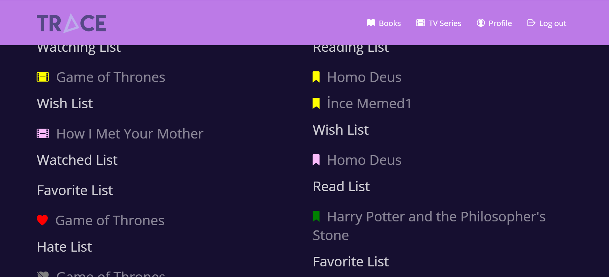
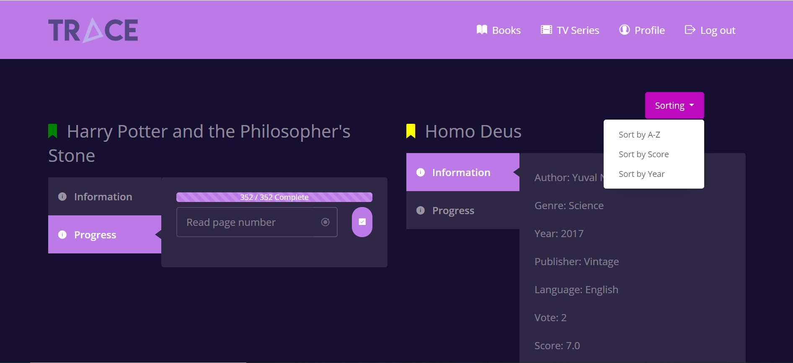
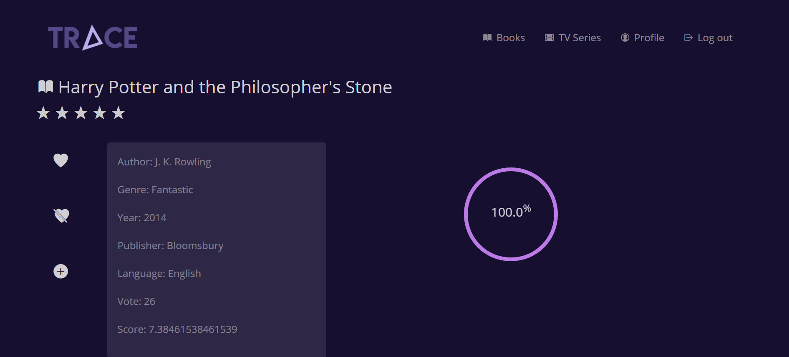
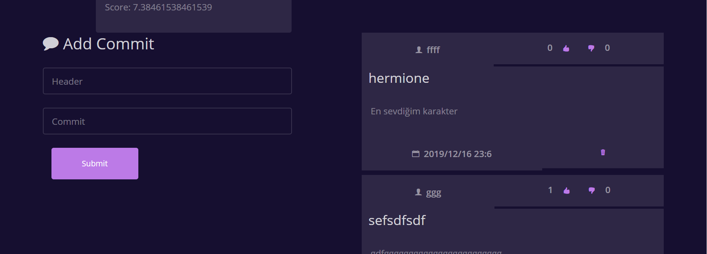

Parts Implemented by Muruvvet Bozkurt
=====================================

This page will be providing information on

* *Home Page for book*
* *Book Page*
* *Dynamic Book Page*

Home Page for book
----------------------
You first see the homepage, after logging in to the website. On the homepage, you can see lists of books you have customized according to your own. Home page contains reading list, wish list, read list, favorite list, hate list. The lists have their own color.
The meaning of colors:
Yellow : book that you are reading. \                                                                                      
Purple : book that you added to your wish list.  \                                                                                       
Green : book that you already read.     \              
Red : book that you added to your favorite list. \
Gray : book that you added to your hate list. \

Pressing the book button enters the book page.

Book Page
-------------

Adding Books
~~~~~~~~~~~~~~~~~
If the book you want does not exist in our database, you are redirected to the add book page by clicking on the "Add book" button.

The information of the desired book is added to the database.

Continuation of the book page 
~~~~~~~~~~~~~~~~~~~~~~~~~~~~~~~~~~

	

Viewing Books
^^^^^^^^^^^^^^^^^^^^^
All books in the database are on this page. All information about the book such as author, publisher, year of publication, language, genre is available on this page. 

Updating and Tracking 
^^^^^^^^^^^^^^^^^^^^^
User may update and track the page they left. If total book page is eequal to pages that user read,  the book is added otomatically read list. If users update page that read is smaller than book total page and is not equal to zero, is added to reading list. There are meaning that the colors of next to book name. Red color means that book is not read by user. Green color means user already read. Yellow color means that user is reading. It is also redirected to the book's dynamic page by clicking on the book's name.

Sorting
^^^^^^^^^^^^^^^^^^^^^
Books can be sorted by alphabetical order, year, and score.

	
Dynamic Book Page
---------------------

	
On this page, you can do many things about the book.

Viewing 
~~~~~~~~~~~~~~~~~
Here you can see information about the book as in "book page".

Adding to lists
~~~~~~~~~~~~~~~~~~~
There are many specific lists like favorite list, wish list, hate list. You can add the book by clicking the icon of the list you want to add. The icon of the list  of color changes when you add the book to a list there. Red color means that book is in favorite list. Gray means that book is in hate list. Green means that book is in wish list.

.. note:: A book can be added to both the favorite list and the hate list.

Rating  
~~~~~~~~~~~~~~~~~
Users can rate the book from 1 to 10 with stars. A user can rate the books as many times as they want. 

.. note:: A user can rate the books as many times as they want.

Progress 
~~~~~~~~~~~~
 You can also keep track of how many percent you read.

Comment for book 
~~~~~~~~~~~~~~~~~~~~~~~~
On this page you can comment on the book. A header must be added to the comment when adding comments. You can see all the comments of this book on this page. There are like and dislike buttons in the comments. You can see how many likes or dislikes are for the comment and the date and time the comments were discarded. You can see all the comments of this book on this page. 

.. note:: A user may like or dislike a comment more than once.

.. warning:: The user can only delete his own comment. Can not delete comments from others.

