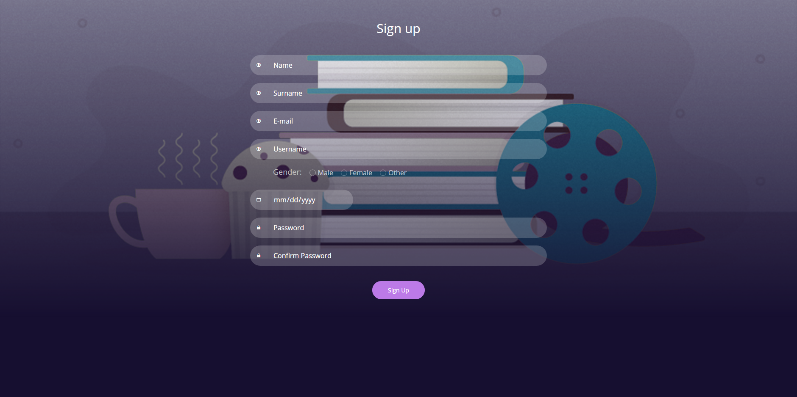
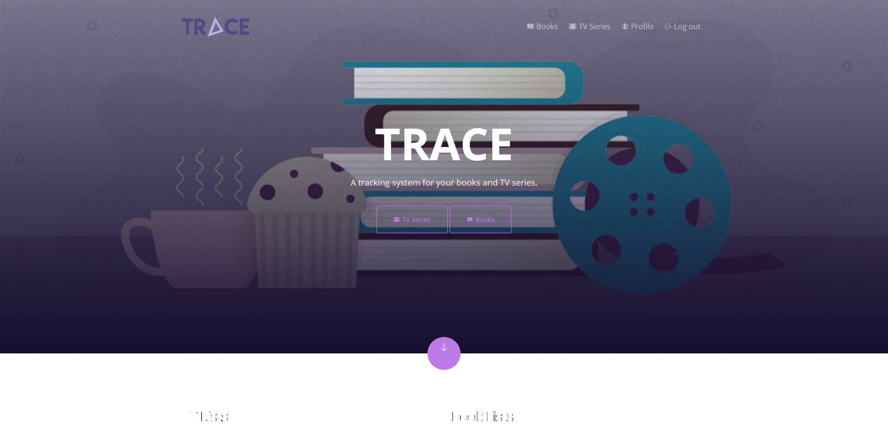
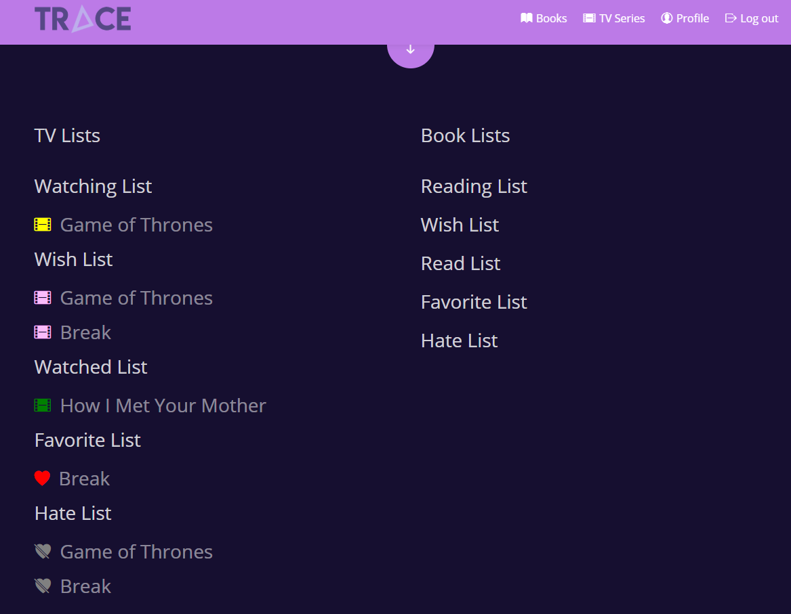
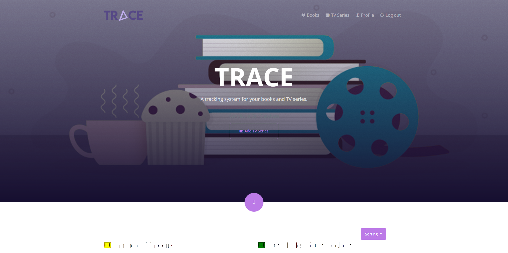
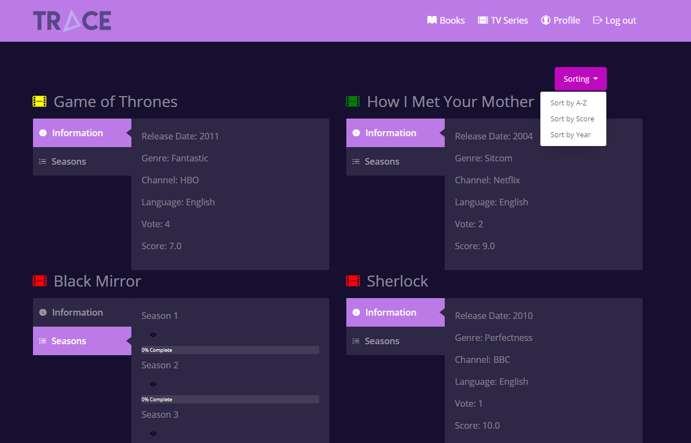
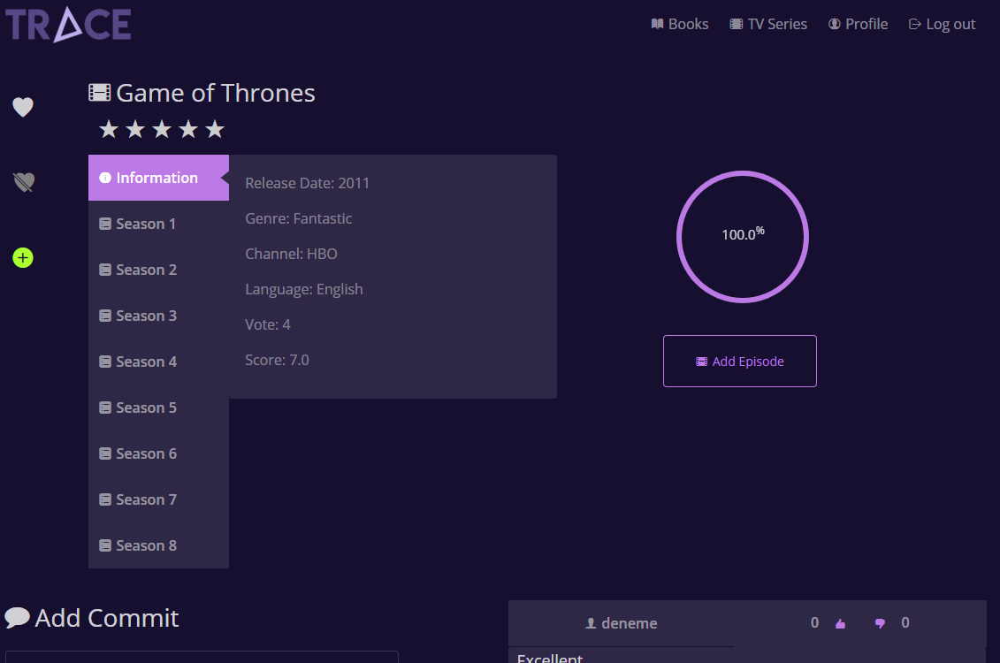
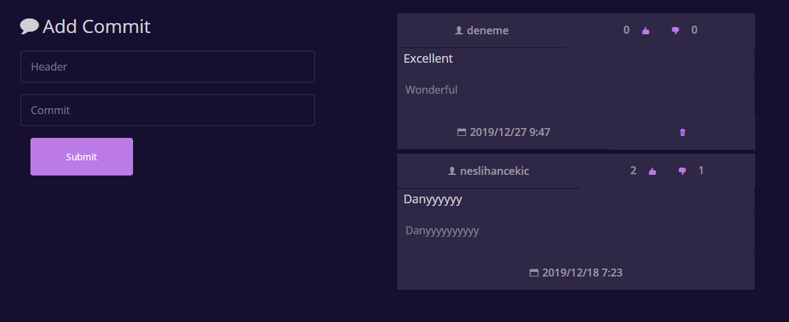

Parts Implemented by Neslihan ÇEKİÇ
===================================

Sign-up Page
---------------

In the sign up page, you must enter your name, surname, e-mail, username, gender, year of birth and password. Only one account can be opened with an e-mail. In the same way, only one account can be opened with a username. If you select a mail or username that already exists, you are notified by a warning alert. You must set your username to a maximum of 20 characters. When you register correctly, you will be directed to the log in page to receive the success alert.

Home Page
---------------

Navigation bar
~~~~~~~~~~~~~~~~~~~~

When you log in to the site, it will automatically open the home page; you can quickly access the tv series and book pages. You can also go to your account page and easily and logout in the navigation bar that appears from the moment you log in.

Access to All Your Lists
~~~~~~~~~~~~~~~~~~~~~~~~~~~~~~

 When you scroll down the page you can see watched, watching, wish, favorite, hate lists for tv series and reading, read, wish, favorite and hate lists for books. You can click on the tvseries or book attached here to access its dynamic page. 

TV Series Home Page
----------------------

Access to Add TV page
~~~~~~~~~~~~~~~~~~~~~~~~~~

When you come to the Tvseries page, you can click the "Add Tv Series" button to add a tvseries that is not in the database. Scroll down to see all the TV series in our database. You can sort these TV series by A to Z, by their score or by their years.

Access to All TV Series
~~~~~~~~~~~~~~~~~~~~~~~~~~~~

* *See Tv Series' Infos*

By default, you can see the release date, genre, channel, language, number of votes and score information for each TV series.

* *TRACE Seasons*

When you click on the "Seasons" panel, you can see all the seasons of that series and see your tracking progress as a percentage for each season. If you click on the eye icon, it will be saved to the database you are watching that season. The eye icon turns purple if you watch the entire season.
The colored symbols at the beginning of the TV series change color depending on how much you watch the TV series. It will turn green if you have finished the series completely, yellow if you have watched a part, and red if you have never started. To reach the page of these series, simply click on the name of the series.

Add TV Series Page
----------------------

On this page, you can add a tvseries that is not in the database by entering the title, channel, language, release year, genre, and season number of the tv series you want to add.

.. figure:: nesli/addtv.png
	:scale: 50 %
	:alt: Add Tv
	:align: center

TV Series Dynamic Page
--------------------------

Rate TV Series
~~~~~~~~~~~~~~~~~~~~~~~~~~~~

You can rate the tv series using 5 stars.

See info and your progress
~~~~~~~~~~~~~~~~~~~~~~~~~~~~~~~~
By default the information of the TV series appears. On the right you can see the progress of watching the entire TV series. 

Access to Add Episode Page
~~~~~~~~~~~~~~~~~~~~~~~~~~~~~~~~
Below progress bar, If the episode you are watching is not in the database, there is an "Add Episode" button to add that episode.

See all episodes and TRACE Episodes
~~~~~~~~~~~~~~~~~~~~~~~~~~~~~~~~~~~~~~~~
You can see the episodes of the season by selecting the season you want, you can mark that you are watching that episode by clicking the eye icon. The icon will be purple colored if you watched the episode.

.. figure:: nesli/dynamic1.png
	:scale: 50 %
	:alt: Episodes
	:align: center

Add Tv series to your lists
~~~~~~~~~~~~~~~~~~~~~~~~~~~~~~~~~~~~

You can add the series to your favorite list, hate list and wish list by clicking the buttons on the left. Icons are colored according to whether they are in that list.

.. figure:: nesli/listsoff.png
	:scale: 50 %
	:alt: Off lists color
	:align: center

.. figure:: nesli/listson.png
	:scale: 50 %
	:alt: On Lists color
	:align: center

Leave a Comment
~~~~~~~~~~~~~~~~~~~~~~~~~~~~~~~~~~~~

When you scroll down the page, you can leave a comment in the TV series, see other comments and vote by like or dislike. You can also delete your own comments.

Add Episode Page
----------------------

The Add episode page is designed specifically for a tvseries. So you can add episodes to the TV series you came from. Enter the name of the episode, season number and episode number and save the episode.
If there is a series of episodes for that season and episode, it informs you with an error message. If you add it successfully, the success message appears.

.. figure:: nesli/addepisode.png
	:scale: 50 %
	:alt: Add Episode
	:align: center
